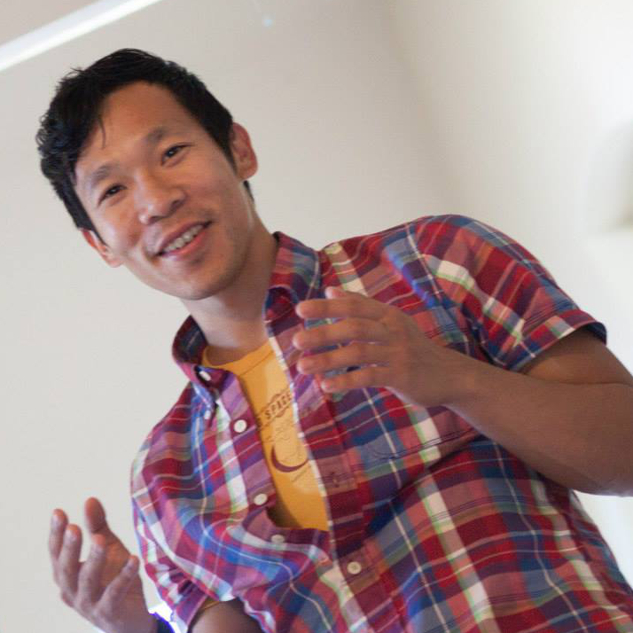

#### Launch Site Locally

```
> git clone git@github.com:colinsheppard10/arcology_website.git
> cd arcology_website
> npm install
> npm start
```

```
> npm install
> npm start
```

Live, play, and work with a community of entrepreneurs, artists, musicians, hackers,
makers, crafters, scientists, researchers, and engineers.

Named after Paolo Soleri's integrated architecture and ecology at
[Arcosanti](https://arcosanti.org/), Arcology draws
inspiration from
[a magical purple nerd castle at MIT](http://tep.mit.edu/),
[Black Rock City](https://burningman.org/),
[Woodard Lane Cohousing](http://www.woodardlanecoho.org/),
[the Israeli moshav at Nahalal](https://en.wikipedia.org/wiki/Nahalal),
the <a href="">Buddhist community home Marpa House</a>,
and the <a href="https://www.youtube.com/watch?v=kBMMRzK8KqE">great work from SimCity</a>.

Our goal is an inter-generational landship to cultivate tribes of happy humans.

## Timeline

### Phase One

#### (completed)

#### 15 June 2016 - 30 April 2018

Minimum liveable product in Bushwick,
one year prototype. 2 bunks in a shared room, 1 private room. Workspace for two.
Internet-controlled door buzzer.

### Phase Two

#### (in progress)

#### 1 April 2018 - 30 April 2019

One year transitional space. 8 bunk beds, 3 private rooms. Three common workspaces.
Door locks, rent payments, expenses, and future housemates governed by an Ethereum DAO.
Rooftop garden and apiary.

### Phase Three

#### (imminent landship)

#### 1 December 2018 - indefinitely

L train closes.
The DAO now owns a 4-story building. 10 bunks in shared rooms, 8 private rooms,
4 family apartments.
Food co-op, coffeeshop, school, event space on ground floor. Equity and dividends in the arcology paid on Ethereum.
### Phase Four

### (self-governance)

Building achieves energy sustainability and self-governance,
with a system for training the next generation of leaders.

## Our Team

<br/>
<div class="bio-name">Paul Pham</div>
<div class="bio-title">Chief Arcologist, Developer</div>
</i>
</i>
</i>
</i>

## <header> Location and Rooms </header>

 <p>
303 Stockholm St, Apt 4F and 4B<br/>
Brooklyn, NY
</p>

 <ul>
  <li>
      <header>Sky room, with 14 foot windows (1P)</header>
      <a href="https://www.airbnb.com/rooms/24063724">
          
      </a>
  </li>
  <li>
      <a href="https://www.airbnb.com/rooms/23838154">
          <header>Private room, on the right-hand path (3P)</header>
          
      </a>
  </li>
  <li>
      <header>Captain's room (4P)</header>
      <a href="">
          
      </a>
  </li>
  <li>
      <a href="https://www.airbnb.com/rooms/23862292">
          <header>Upper bunk in two-person shared room (5U)</header>
          
      </a>
  </li>
  <li>
         <a href="https://www.airbnb.com/rooms/23862384">
          <header>Lower bunk in two-person shared room (5L)</header>
          
      </a>
  </li>
  <li>
      <a href="https://www.airbnb.com/rooms/23308575">
          <header>Upper bunk in two-person shared room (6U)</header>
          
      </a>
  </li>
  <li>
      <a href="https://www.airbnb.com/rooms/23862431">
          <header>Lower bunk in two-person shared room (6L)</header>
          
      </a>
  </li>
  <li>
      <a href="https://www.airbnb.com/rooms/23811439">
          <header>Private room on the left-hand path (7P)</header>
          
      </a>
  </li>
  <li>
      <a href="https://www.airbnb.com/rooms/24039445">
          <header>Upper bunk in two-person shared room (8U)</header>
          
      </a>
  </li>
  <li>
      <a href="https://www.airbnb.com/rooms/23881996">
          <header>Lower bunk in two-person shared room (8L)</header>
          
      </a>
  </li>
</ul>
